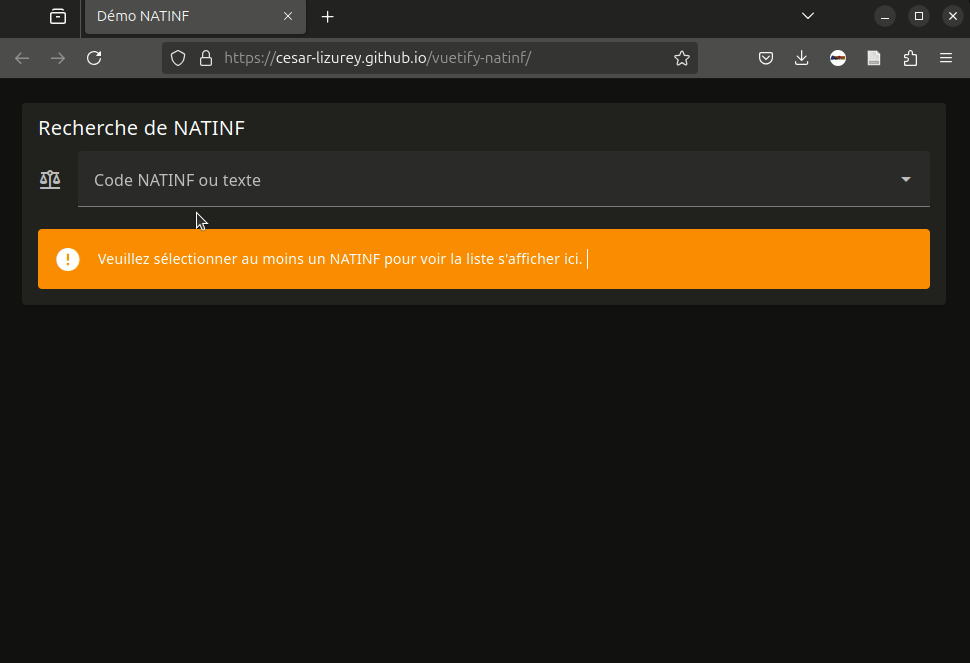

# Vuetify-NATINF

Ensemble de composants Vue pour gérer NATINF, embellis par Vuetify:

* un composant de recherche, qui permet de chercher un NATINF par son code ou une liste de NATINF par du texte;
* un composant d'affichage, qui affiche le NATINF et permet d'avoir des informations supplémentaires lorsque l'on clique dessus.

## Démonstration

[Voir la démo en ligne](https://cesar-lizurey.github.io/vuetify-natinf/)



## Origine

J'ai tout d'abord cherché s'il existait un formulaire de recherche en ligne où on pourrait chercher des NATINF facilement, sans succès. Je me suis naturellement tourné vers [data.gouv.fr](https://www.data.gouv.fr), où j'ai trouvé la donnée qui m'intéressait. Malheureusement l'onglet "Réutilisations et API" n'offrait pas le formulaire de recherche que je souhaitais.

J'ai donc décidé de le créer, et de développer par la même occasion des composants VueJS (puisqu'il est de notoriété publique que VueJS est beaucoup mieux que React) en utilisant la bibliothèque Vuetify pour un joli rendu.

## Installation

```bash
npm install vuetify-natinf
```

Si vous n'avez pas installé Vuetify et les icônes `materialdesignicons`:

```bash
npm i --save vuetify
npm i --save @mdi/font
```

## Utilisation

Dans votre fichier `main.js` il faut charger l'ensemble des éléments:

```javascript
import { createApp } from 'vue'
import './style.css'
import App from './App.vue'

// Vuetify
import '@mdi/font/css/materialdesignicons.css';
import 'vuetify/styles';
import { fr } from 'vuetify/locale';
import { createVuetify } from 'vuetify';
import * as components from 'vuetify/components';
import * as directives from 'vuetify/directives';
import VuetifyNATINF from 'vuetify-natinf';


const app = createApp(App);
const vuetify = createVuetify({
    theme: {
      defaultTheme: 'dark',
    },
    locale: {
      locale: 'fr',
      messages: { fr },
    },
    components,
    directives,
  });
app.use(vuetify);
app.use(VuetifyNATINF);

app.mount('#app');
```

Dans chacun de vos composants vous pouvez désormais utiliser le module de recherche:

```html
    <recherche-NATINF multiple></recherche-NATINF>
```

Mais également le module d'affichage de NATINF sous forme de cartouche. Attention, il s'agit d'un composant asynchrone puisque des données doivent être chargées depuis l'API, il faut donc utiliser `Suspense`:

```html
    <Suspense>
      <template #default>
        <v-card>
          <v-card-title>
            Liste des NATINF
          </v-card-title>
          <v-card-text>
            <cartouche-NATINF v-for="natinf in [74, 7151]" :key="`NATINF-${natinf}`" :natinf="+natinf" class="my-2" />
          </v-card-text>
        </v-card>
      </template>
      <template #fallback>
        <div>Chargement...</div>
      </template>
    </Suspense>
```

## Remarques

L'état du code n'est pas satisfaisant. En effet, les requêtes s'appuient sur l'[API tabulaire](https://www.data.gouv.fr/fr/dataservices/api-tabulaire-data-gouv-fr-beta/) de [data.gouv.fr](https://www.data.gouv.fr). Cette API tabulaire se base sur les données NATINF alimentées par le Ministère de la Justice, accessibles [ici](https://www.data.gouv.fr/fr/datasets/liste-des-infractions-en-vigueur-de-la-nomenclature-natinf/#/resources).

Malheureusement, il y a deux écueils:

* le premier, le plus dommageable fonctionnellement, est qu'il n'existe pas de version "à jour" (ou "latest") des NATINF. Dès qu'une mise à jour est réalisée et de nouveaux NATINF ajoutés, c'est un nouveau fichier qui est créé, il faut donc changer en dur le lien dans le code. Il conviendrait d'avoir un fichier "à jour" nominal, la discussion est ouverte [ici](https://www.data.gouv.fr/fr/datasets/liste-des-infractions-en-vigueur-de-la-nomenclature-natinf/#/discussions/66ed7e356920866da88a91d5);
* le second qui est dommageable du point de vue de la syntaxe est la structure du fichier. Si vous fouillez dans le code, vous constaterez que les noms de colonnes ne sont pas canoniques, en raison de la structure des données sources. La discussion est ouverte [ici](https://www.data.gouv.fr/fr/datasets/liste-des-infractions-en-vigueur-de-la-nomenclature-natinf/#/discussions/67842ae8562f8ec5aae45a5c)